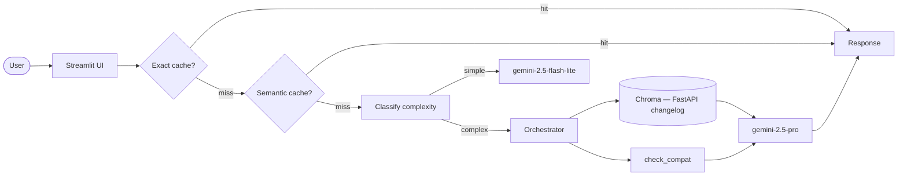

# FastAPI Changelog Q&A

> Pesquise features, breaking changes e compatibilidade do FastAPI por versão — com citação direta do release notes oficial.

<!-- TODO: cole aqui o GIF de demo (10-15s, <5MB) -->

**Live demo:** TODO — substituir pelo link do Streamlit Cloud após deploy

## Problem statement

1. Devs que atualizam o FastAPI precisam saber "o que mudou entre a versão que uso e a nova?" — o changelog tem 7000+ linhas e é difícil de navegar manualmente.
2. Para qualquer desenvolvedor Python que usa FastAPI e precisa avaliar breaking changes antes de atualizar.
3. LLM + RAG + Tool-use é a abordagem certa porque: RAG recupera os trechos exatos do changelog por versão, e a tool `check_compat` filtra deterministicamente por range de versões — o LLM não precisa "lembrar" do histórico.

## Arquitetura



## Setup

```bash
# 1. Clone
git clone <seu-repo>
cd template-portfolio

# 2. Dependências
uv venv && source .venv/bin/activate
uv sync

# 3. API key
cp .env.example .env
# edite .env com sua GEMINI_API_KEY

# 4. Corpus — já incluído em data/corpus/fastapi-release-notes.md
#    Para atualizar: git clone --depth 1 https://github.com/tiangolo/fastapi /tmp/fastapi
#                    cp /tmp/fastapi/docs/en/docs/release-notes.md data/corpus/

# 5. Rodar local
streamlit run src/ui/streamlit_app.py
```

## Cost & Latency

TODO — preencher após rodar bench de 50 queries.

| Estratégia | Custo total | Redução | P95 latency |
|---|---:|---:|---:|
| Baseline (premium sempre) | $X.XX | — | XX ms |
| + Exact cache | $X.XX | XX% | XX ms |
| + Semantic cache | $X.XX | XX% | XX ms |
| **+ Routing cheap-first** | **$X.XX** | **XX%** | **XX ms** |

Meta da rubrica (banda "excelente"): **≥50% de redução** + P95 reportado.

## Design decisions

- **Chunking por seção de versão (`## X.Y.Z`):** preserva contexto de cada release intacto; chunk por caractere quebraria entradas de changelog no meio, perdendo a versão de referência.
- **check_compat como tool, não RAG:** filtrar por range de versão é uma operação determinística — regex + comparação de tuplas. RAG retornaria resultados aproximados; a tool garante exatidão.
- **chunk_size=800, overlap=100:** seções curtas de versão cabem num chunk; overlap evita perda de contexto nas seções longas (ex: 0.100.0).
- **Threshold semântico 0.93:** perguntas sobre versões diferentes são semanticamente próximas ("o que mudou na 0.100?" ≈ "o que mudou na 0.110?") — threshold alto evita cache hit incorreto.
- **Routing por heurística:** "compare", "analise", "explique" → modelo premium; perguntas diretas de versão → modelo barato.

## Limitations

- Corpus cobre apenas o histórico até a data do clone — não atualiza automaticamente.
- `check_compat` filtra por palavras-chave ("breaking", "deprecated", "removed") — mudanças implícitas podem não aparecer.
- Free tier do Gemini limita a 15 RPM.

## Perguntas de teste

```
1. Quando o suporte a Python 3.6 foi removido?
2. Quais são os breaking changes entre 0.95.0 e 0.100.0?
3. Quando o Annotated passou a ser recomendado?
4. O que mudou na versão 0.110.0?
5. Quais features foram adicionadas no FastAPI 0.100?
```

## Tech stack

- **LLM:** Gemini 2.5 Flash-Lite (cheap) / Gemini 2.5 Pro (premium)
- **Embeddings:** gemini-embedding-001
- **Vector store:** Chroma local
- **UI:** Streamlit
- **Corpus:** FastAPI release notes (~7000 linhas, markdown)
- **Deploy:** Streamlit Community Cloud

## Estrutura

```
template-portfolio/
├── data/
│   ├── corpus/
│   │   └── fastapi-release-notes.md
│   └── chroma/           # vector store (gitignored)
├── src/
│   ├── ui/streamlit_app.py
│   ├── pipeline/
│   │   ├── rag.py        # ingest (.pdf + .md + .txt) + retrieve + answer
│   │   ├── tools.py      # check_compat (FastAPI changelog)
│   │   ├── cache.py      # exact + semantic cache
│   │   └── routing.py    # cheap-first routing
│   └── observability/trace.py
├── tests/test_smoke.py
├── pyproject.toml
└── .env.example
```

---

*Projeto Portfolio — Disciplina "Desenvolvendo Software com IA Generativa" (Mod4 PPI).*
